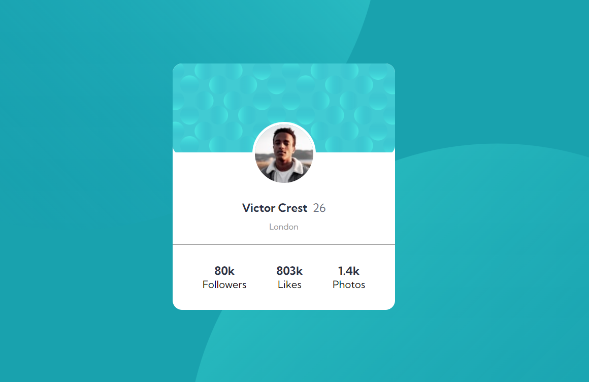
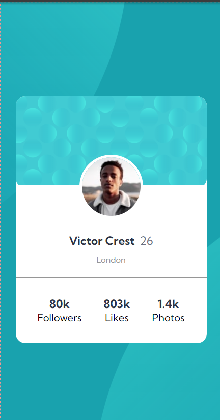

# Make It Real - Profile Card Component with React

This is a solution to the Profile Card Component with React, built during the Make It Real course. I based it on the following [repository](https://github.com/PunoBootcamper/profile-card-component.git).

## Table of contents

- [Overview](#overview)
  - [The challenge](#the-challenge)
  - [Screenshot](#screenshot)
- [My process](#my-process)
  - [Built with](#built-with)
  - [What I learned](#what-i-learned)
  - [Continued development](#continued-development)
  - [Useful resources](#useful-resources)
- [Author](#author)
- [Acknowledgments](#acknowledgments)

## Overview

### The challenge

Users should be able to:

- Create a responsive order profile card using React.
- Utilize Vite for development and build processes.
- Implement modular CSS using the BEM (Block Element Modifier) methodology.
- Utilize props

### Screenshot




## My process

### Built with

- React for building the user interface
- Vite for fast development and build tool
- BEM (Block Element Modifier) methodology for modular CSS
- Responsive design principles

### What I learned

While working on this project, I deepened my understanding of component-based development with React and improved my skills in modular CSS using the BEM methodology. I also gained hands-on experience with Vite as a build tool, which streamlined the development process.

Here is an example of CSS using the BEM methodology:

```css
.order-summary__title {
    font-size: 23px;
}

.order-summary__plan-box {
    align-items: center;
    padding: 12px;
}

```

If you want more help with writing markdown, we'd recommend checking out [The Markdown Guide](https://www.markdownguide.org/) to learn more.

### Continued development

In future projects, I plan to continue refining my React skills and exploring advanced features and hooks. Additionally, I aim to enhance my understanding of Vite and its capabilities, and further improve my CSS practices and responsive design techniques.

### Useful resources

- [Quick start React](https://react.dev/learn) - This resource provided a solid foundation for understanding React and its core concepts.

## Author

- Github - [william lupaca](https://github.com/PunoBootcamper)


## Acknowledgments

Thanks to the Make It Real course for providing this challenge and the helpful resources that guided me throughout the process.